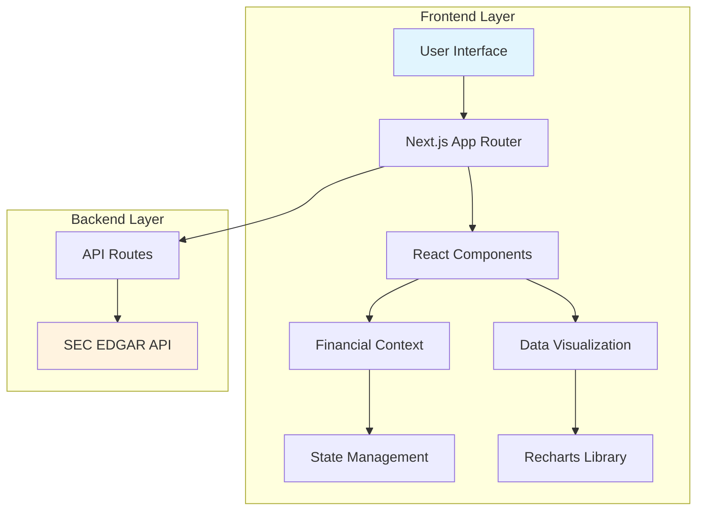
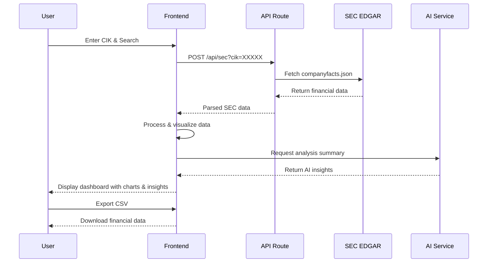

# Financial Explorer

A modern, production-ready web application for exploring and analyzing SEC EDGAR company financial data. Built with Next.js 16, TypeScript, and Tailwind CSS, featuring real-time data visualization, AI-powered insights, and comprehensive financial metrics.

## Features

- SEC EDGAR Integration: Direct access to verified SEC filing data
- Real-time Search: Search companies by CIK (Central Index Key)
- Multi-metric Analysis: Revenue, Net Income, Assets, and Liabilities
- Interactive Charts: Bar charts and line graphs with Recharts
- AI-Powered Insights: Automated financial analysis summaries
- Data Export: CSV export functionality for financial data
- Responsive Design: Mobile-first design with Tailwind CSS
- Type-Safe: Full TypeScript implementation with strict typing

## Architecture Overview



## Application Flow



## Project Structure

```
financial-explorer/
├── app/                          # Next.js App Router
│   ├── api/
│   │   └── sec/
│   │       └── route.ts         # SEC API proxy endpoint
│   ├── globals.css              # Global styles
│   ├── layout.tsx               # Root layout
│   └── page.tsx                 # Main dashboard page
├── components/                   # Reusable UI components
│   ├── SearchBar.tsx            # Search input component
│   ├── MetricHighlight.tsx      # KPI display cards
│   ├── ErrorBanner.tsx          # Error message display
│   ├── HeroSection.tsx          # Landing page hero
│   └── DataDashboard.tsx        # Main data visualization
├── context/                      # React context providers
│   └── FinancialContext.tsx     # Financial data state management
├── lib/                         # Utility functions
│   ├── financial.ts             # Financial data processing
│   └── sec.ts                   # SEC API utilities
├── types/                       # TypeScript type definitions
│   └── financial.ts             # Financial data types
├── public/                      # Static assets
├── tailwind.config.js           # Tailwind CSS configuration
├── next.config.ts               # Next.js configuration
├── tsconfig.json                # TypeScript configuration
├── eslint.config.mjs            # ESLint configuration
└── package.json                 # Dependencies and scripts
```

## Tech Stack

### Frontend
- Framework: Next.js 16 (App Router)
- Language: TypeScript
- Styling: Tailwind CSS
- Charts: Recharts
- Icons: Lucide React
- State Management: React Context API

### Backend
- API Routes: Next.js API Routes
- External APIs: SEC EDGAR API
- Data Processing: Custom utility functions

### Development Tools
- Linting: ESLint
- Type Checking: TypeScript
- Build Tool: Next.js (Turbopack)
- Package Manager: npm

## Getting Started

### Prerequisites

- Node.js 18+ and npm
- Git

### Installation

1. Clone the repository
   ```bash
   git clone <repository-url>
   cd financial-explorer
   ```

2. Install dependencies
   ```bash
   npm install
   ```

3. Environment Setup (Optional)
   ```bash
   # Create .env.local for custom SEC User-Agent
   echo "SEC_EDGAR_USER_AGENT=Your Name (your.email@example.com)" > .env.local
   ```

4. Run development server
   ```bash
   npm run dev
   ```

5. Open in browser
   ```
   http://localhost:3000
   ```

## Usage

### Searching for Companies

1. Enter a CIK (Central Index Key) in the search bar
2. Popular examples:
   - Apple Inc.: 320193
   - Microsoft Corporation: 789019
   - Tesla, Inc.: 1318605

### Exploring Financial Data

1. View Metrics: Switch between Revenue, Net Income, Assets, and Liabilities
2. Time Range: Select 5 years, 10 years, or maximum available history
3. Visualization: Toggle between chart and table views
4. AI Insights: View automated financial analysis summaries

### Exporting Data

- Click "CSV" button to download financial data as CSV file
- Click "PDF Report" to generate a printable report

## API Reference

### SEC Data Endpoint

GET /api/sec?cik={cik}

Fetches company financial data from SEC EDGAR.

Parameters:
- cik (string, required): Company CIK (10-digit, zero-padded)

Response:
```json
{
  "entityName": "Apple Inc.",
  "cik": "0000320193",
  "facts": {
    "us-gaap": {
      "Revenues": {
        "units": {
          "USD": [
            {
              "form": "10-K",
              "fy": 2023,
              "val": 383285000000
            }
          ]
        }
      }
    }
  }
}
```

### AI Summary Endpoint

POST /api/summarize

Generates AI-powered financial analysis.

Request Body:
```json
{
  "entityName": "Apple Inc.",
  "metricName": "Revenue",
  "latestValue": 383.3,
  "previousValue": 365.8
}
```

Response:
```json
{
  "summary": "Apple Inc. shows a 4.8% increase in revenue year-over-year..."
}
```

## Component Architecture

### Core Components

- SearchBar: Handles CIK input and search functionality
- HeroSection: Landing page with main search interface
- DataDashboard: Main visualization component with charts and metrics
- MetricHighlight: Individual KPI display cards
- ErrorBanner: Error state display component

### Context Providers

- FinancialContext: Manages global financial data state
- Provides loading states, error handling, and data fetching

### Utility Libraries

- financial.ts: Data processing and transformation functions
- sec.ts: SEC API URL construction and configuration

## Security & Compliance

- SEC Compliance: Proper User-Agent headers for SEC EDGAR API
- Rate Limiting: Built-in caching to respect SEC API limits
- Data Validation: TypeScript ensures data integrity
- Error Handling: Comprehensive error boundaries and fallbacks

## Deployment

### Vercel (Recommended)

1. Connect GitHub repository to Vercel
2. Deploy automatically on push to main branch
3. Environment variables configured in Vercel dashboard

### Manual Deployment

```bash
# Build for production
npm run build

# Start production server
npm start
```

### Docker Deployment

```dockerfile
FROM node:18-alpine
WORKDIR /app
COPY package*.json ./
RUN npm ci --only=production
COPY . .
RUN npm run build
EXPOSE 3000
CMD ["npm", "start"]
```

## Contributing

1. Fork the repository
2. Create a feature branch: git checkout -b feature/amazing-feature
3. Commit changes: git commit -m 'Add amazing feature'
4. Push to branch: git push origin feature/amazing-feature
5. Open a Pull Request

### Development Guidelines

- Use TypeScript for all new code
- Follow ESLint configuration
- Write meaningful commit messages
- Test components and utilities
- Update documentation for API changes

## License

This project is licensed under the MIT License - see the LICENSE file for details.

## Acknowledgments

- SEC EDGAR API for financial data access
- Next.js team for the excellent framework
- Recharts for data visualization components
- Tailwind CSS for utility-first styling

## Support

For questions or issues:
- Open an issue on GitHub
- Check the Next.js documentation
- Review SEC EDGAR API documentation

Built with Next.js, TypeScript, and modern web technologies.
